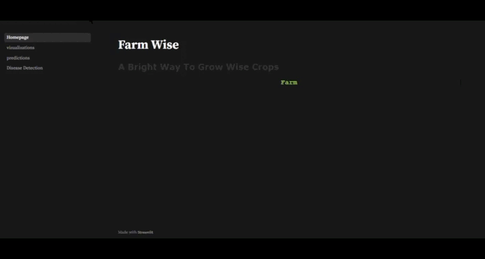
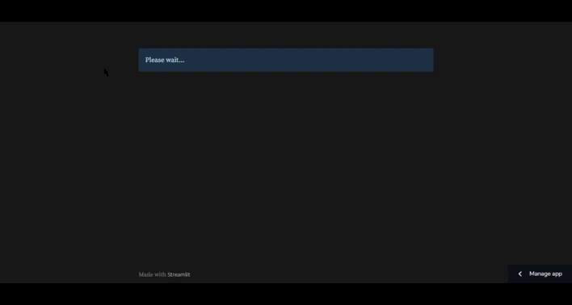
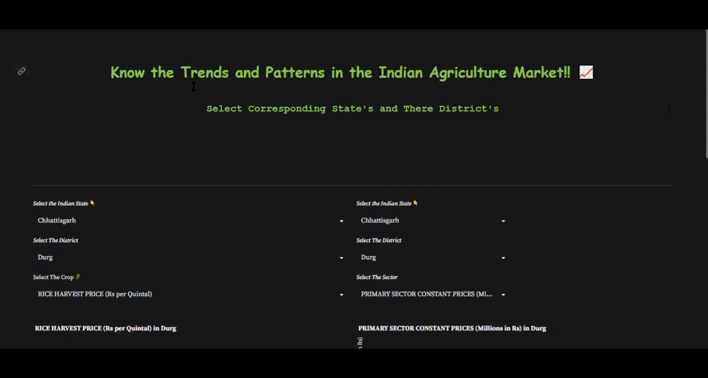
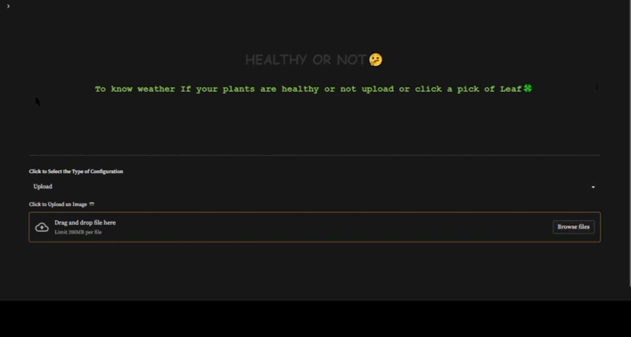

# Farm Wise 🌿

#### A compact website build on various factors,addressing issues of farmers regarding their crops, this website has three main parts.The first part being a **_visualization_** playground. Where trends according to the market can be seen, second being **_prediction_** where depending upon various factors of soil quality one can predict the type of crop he could grow. One cache if the person wanna grow another crop based on the same nutrients he can know what changes are required. Last one being **_Classification_**, in this page users are required to either click on image or upload an image of the leaf or plant whichever is possible to know what disease one's field is having.

#### [Access the app deployed on google cloud here](https://farmwise-qu362vvgoa-el.a.run.app/)

#### [Access the app deployed on Streamlit cloud here](https://farmwise0.streamlit.app/)

## DISCLAIMER ⚠️

#### This is a POC(Proof of concept) kind-of project. The data used here comes up with no guarantee from the creator. So, don't use it for making farming decisions. If you do so, the creator is not responsible for anything. However, this project presents the idea that how we can use ML/DL into precision farming if developed at large scale and with authentic and verified data also, how emerging state of the art technology can be used for advanced development in farming.

## MOTIVATION 💪

- In countries like India, the majority of the population is dependent on agriculture for their livelihood. Many new technologies, such as Machine Learning and Deep Learning, are being implemented into agriculture so that it is easier for farmers to grow crops and maximize their yield. Farming is one of the major sectors that influences a country’s economic growth.

- In this project, I present a website in which the following applications are implemented: Crop Recommendation, visualization and Disease Classification respectively.

## DATA SOURCE 📊

- [Disease detection dataset](https://www.kaggle.com/vipoooool/new-plant-diseases-dataset)
- [Crop recommendation dataset ](https://www.kaggle.com/atharvaingle/crop-recommendation-dataset)
- [Fertilizer suggestion dataset](https://github.com/Gladiator07/Harvestify/blob/master/Data-processed/fertilizer.csv)
  **Data Wrangling has been performed to make working with data more feasible**

# Built with 🛠️

<code></code>
<code></code>
<code></code>

<code></code>
<code></code>

<code></code>
<code></code>
<code></code>
<code></code>
<code></code>

## How to use 💻

- _Predictin System_: enter the corresponding nutrient values of your soil, state and city. Note that, the N-P-K (Nitrogen-Phosphorus-Potassium) values to be entered should be the ratio between them. Refer [this website](https://www.gardeningknowhow.com/garden-how-to/soil-fertilizers/fertilizer-numbers-npk.htm) for more information. Navie Bayes classifier have been used for the classification
  Note: [Weather API](https://openweathermap.org/) from where humidity, temperature data is fetched.

- _visualization_: At first there might note seem any importance for this. But in the current era, always being up-to-date is important. What's working? and what's not actually working?, is the question that can be solved with this page. Across various sectors and various types of crops distribution is shown in various Indian states.

- _Image Classification System_: The user can upload an image in this or either take a clear picture with less stuff placed in the background for clear prediction. CNN has been trained on few thousand of images

## Below are Few working videos of our WebAPP







---

## How to run locally 🛠️

- Before the following steps make sure you have [git](https://git-scm.com/download), [Anaconda](https://www.anaconda.com/) or [miniconda](https://docs.conda.io/en/latest/miniconda.html) installed on your system
- Clone the complete project with `git clone https://github.com/Mohammed-Altaf-01/gfg_hackathon-.git` or you can just download the code and unzip it

- It is highly recommended to clone the main branch for running the project locally
- Once the project is cloned, open anaconda prompt in the directory where the project was cloned and paste the following block
  ```
  conda create -n Farmwise python=3.6.12
  conda activate Farmwise
  pip install -r requirements.txt
  ```
- And finally run the project with
  ```
  streamlit run  Homepage.py
  ```
- Open the localhost url provided after running `main.py` and now you can use the project locally in your web browser.

## Usage ⚙️

You can use this project for further developing it and adding your work in it. If you use this project, kindly mention the original source of the project and mention the link of this repo in your report.

## Further Improvements 📈

This was my first big project so there are lot of things to improve upon

- CSS code is totally messed up :pensive: (some code in file and some inline)
- This app is purely made in python, fullstack can be used for creating API endpoints using django,flask or fastapi.
- More data can be collected manually via web scraping to make the system more accurate :monocle_face:
- Additional plant images can be collected to make the disease detection part more robust and generalized :face_with_head_bandage:
- Modularized code can be written instead of writing in Jupyter Notebooks, and more scalability can be increased!

## 🔗 Links

[](https://www.linkedin.com/in/mohammed-altaf321/)
